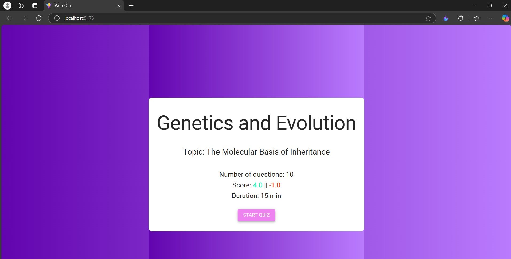
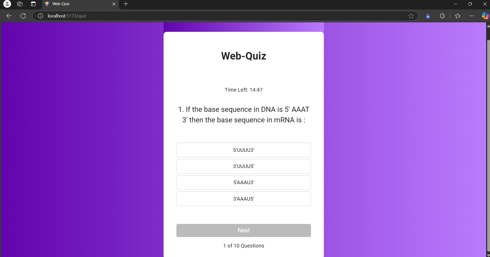
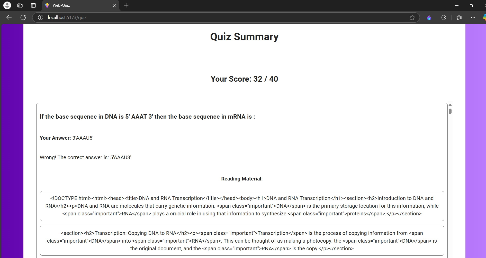

# Quiz App

## Setup Instructions
1. Clone the repository.
2. Navigate to the project directory.
3. Install dependencies: `npm install`
4. Start the development server: `npm run dev`

## Project Overview
- Features: Start Quiz, Multiple-Choice Questions, Summary of Results
- Technologies: React, Axios, React Router

## Screenshots

## Video Walkthrough
[Link to video]()
